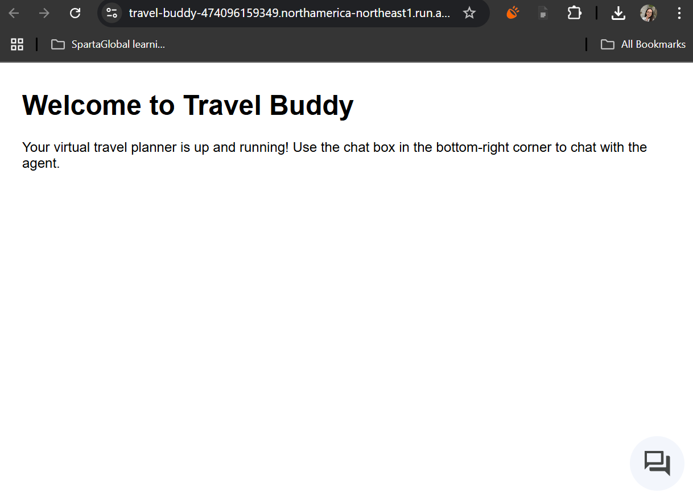
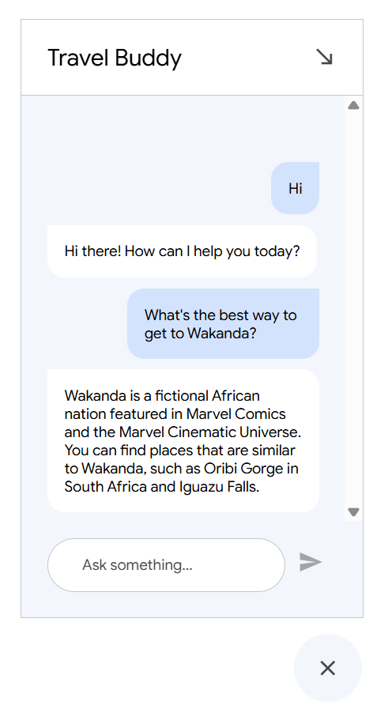

# Travel buddy AI agent

- [Travel buddy AI agent](#travel-buddy-ai-agent)
  - [Purpose of this project](#purpose-of-this-project)
  - [Requirements](#requirements)
  - [Data store](#data-store)

## Purpose of this project

- 

## Requirements

- an `app.py` file containing the code for a basic Flask app
- an `index.html` containing the code for the app's landing page
- a `Dockerfile` with instructions on how to build the image
- a GCP Artifact Repository (standard, type Docker) with the correct permissions to push the image to

## Data store

- A data store was added to instruct the agent on how to respond to travel questions for Wakanda

