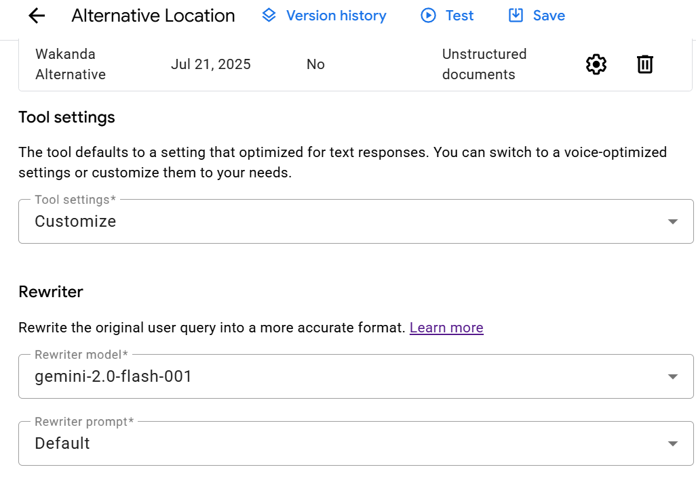

# Travel buddy AI agent

- [Travel buddy AI agent](#travel-buddy-ai-agent)
  - [Goal of this project](#goal-of-this-project)
  - [Requirements](#requirements)
  - [Steps](#steps)
  - [CICD (TBC)](#cicd-tbc)

## Goal of this project

- To create and deploy an AI agent using Vertex AI and Cloud Run that helps users plan travel
- [Project original source here](https://codelabs.developers.google.com/devsite/codelabs/building-ai-agents-vertexai?hl=en#1)

## Requirements

- a GCP account
- an `app.py` file containing the code for a basic Flask app
- an `index.html` file containing the code for the app's landing page
- a `Dockerfile` with instructions on how to build the image
- a GCP Artifact Repository (standard, type Docker) with the correct permissions to push the image to
- a file to be added as a data store, which provides additional knowledge base for the agent to consult (on top of the model's default knowledge base) — specifically, this data store instructs the agent on how to handle travel-related queries for Wakanda, a fictional location that the base model doesn't contain travel information for

## Steps

1. Create a conversational agent based on a Gemini model (e.g. *gemini-1.5-flash*)
2. Enable the required API
3. Create the playbook for the agent, with the goal of helping customers answer travel-related queries
4. Add instructions to the playbook:
   1. Greet users and ask how you can help them
   2. Use ${TOOL: Alternative Location} if the user's request contains a location that does not exist
5. Add a datastore to the model to handle queries about Wakanda from the file *gs://ai-workshops/agents/data/wakanda.txt*
6. Under *Tool settings*, select *Customize* and choose a model 
7. Choose *Very low* in the *Grounding* settings
8. Save and wait 10-15 minutes for the data store to be processed
9. Test the agent by asking it questions about Wakanda:
  - "What's the best way to get to Wakanda?" 
  - "Did any real locations inspire Wakanda?" 
10. Publish the agent
11. Use the CSS code snippet from the step above to generate code for a simple Flask web app and save this code in a file called *app.py*
12. Create a *requirements.txt* file with the web app's dependencies
13. Create a Dockerfile
14. Use a `gcloud` command to build and push a Docker image for this containerised app to **existing GCR repository**, e.g. `gcloud builds submit --tag gcr.io/<project name>/<existing GCR repo>` 
15.  Deploy the app to Cloud Run with a `gcloud run deploy` command, e.g. `gcloud run deploy travel-buddy --image gcr.io/vertex-ai-projects-466609/travel-buddy --platform managed --region northamerica-northeast1 --allow-unauthenticated` (**the latter flag is for testing only**) 

- Working app: 
- Testing the agent's ability to handle Wakanda-related travel questions 

## CICD (TBC)

- Ensure the GitHub-Jenkins webhook has the right IP address
- In the local testing branch of the gcp-update-ai-agent-cicd repo, make a change (e.g. changing the playbook's description)
- Push the changes to the remote testing branch
- This will trigger the Jenkins pipeline, which will merge the changes from the testing branch to main and then deploy the agent
- Verify that the changes are now live via the GCP console